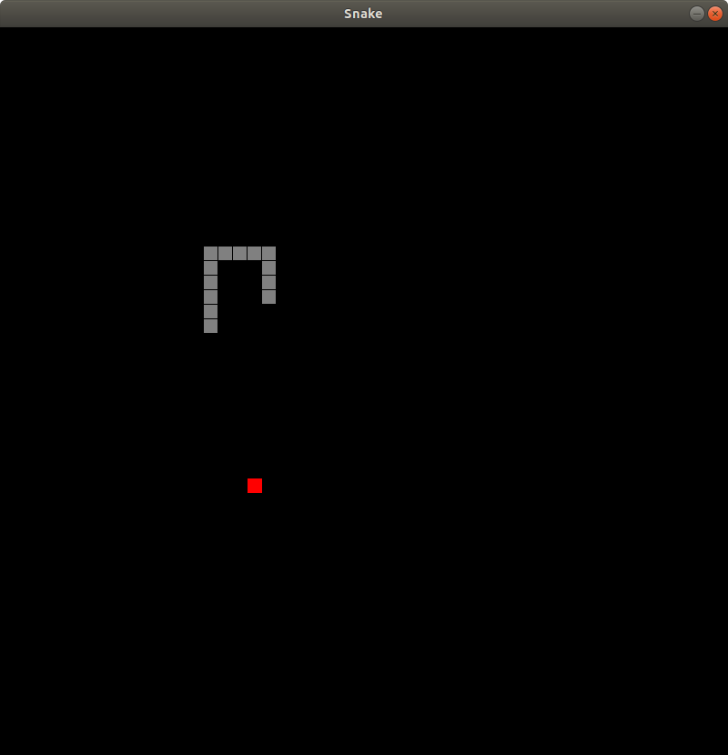

# Snake
A barebones version of Snake I made in between classes.  
In order to run it, all you need is:  
+ [A Go compiler](https://golang.org)  
+ [faiface/pixel 2D game library](https://github.com/faiface/pixel)  

